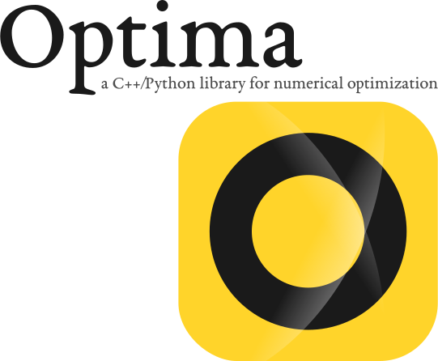

# Overview

Optima is a general-purpose C++/Python library for solving linear and non-linear constrained optimization problems.

> Optima is still under development and its API can change at any time. At the moment, Optima is mainly used in [Reaktoro](https://reaktoro.org) for minimization computations related to chemical equilibrium calculations. A documentation webpage for Optima is still missing to demonstrate all its use cases, which shall be implemented in the coming months.

# Installing

Installing Optima is relatively easy as shown below.

~~~shell
git clone https://github.com/reaktoro/optima
cmake -P optima/install
~~~

The above commands will:

1. **download** the source code from its [GitHub repository](https://github.com/reaktoro/optima) into a directory called `optima`;
2. **configure** the build and installation process;
3. **build** the C++ library and the Python package in the directory `optima/build`; and
4. **install** the C++ header files, C++ library and Python package in `optima/build/install`.

> **Parallel build.** The above build operation is performed in parallel. For repeated build operations, it is recommended to have `ccache` installed for blazing-fast rebuilds.

The previous commands have the following dependencies:

* `git`
* `cmake` (v3.14+)
* `pybind11` (v2.5+)

> **Ignoring Python bindings.** To disable the build of the Python bindings of the C++ components of Optima, and also its Python package `optima`, use the following install command instead:
>~~~shell
>cmake -DPYTHON=OFF -P optima/install
>~~~

> **Customizing build directory.** By default, Optima is built in a directory called `build` inside the `optima` directory. This is the directory where `git` downloaded the source code into. Use the `-DBUILD_PATH=path` argument to specify a different build directory:
>~~~shell
>cmake -DBUILD_PATH=path/to/build -P optima/install
>~~~

> **Customizing install path.** Use the `-DINSTALL_PATH=path` argument to specify a different installation directory (use a global path, not relative):
>~~~shell
>cmake -DINSTALL_PATH=/usr/local -P optima/install
>~~~

> **Customizing build type.** By default, Optima is compiled in `Release` mode. Use the `-DBUILD_TYPE=mode` argument to set one of the following modes `Debug`, `Release`, `MinSizeRel`, `RelWithDebInfo`:
>~~~shell
>cmake -DBUILD_TYPE=Debug -P optima/install
>~~~

> **What have been installed?** You should find the C++ header files of Optima under the `include` directory and the compiled C++ Optima library under `lib`. The Python package `optima` should be located under `lib/python3.x/site-packages`, provided it was considered during the building step. In the previous path, replace `x` by the minor version of your Python executable.

For more options on how to customize the installation process, check the installation summary printed at the end of the command.

# Testing

Optima relies on its Python package `optima` and on `pytest` for testing purposes. Thus, ensure the Python bindings of Optima have been built before you proceed to the step below!

Before executing the tests, ensure the environmental variable  `PYTHONPATH` contains the path to Python package `optima`:

~~~shell
export PYTHONPATH=path/to/optima/build/install/lib/python3.x/site-packages/
~~~

> **Be carefull here!** The path above must be a global path, not a relative one. Don't forget also to change `python3.x` by `python3.7`, `python3.8`, or whatever python version you have.

To execute all tests, do:

~~~shell
cd optima
pytest .
~~~

# Contact

Use [GitHub Issues] for reporting bugs and other issues.

[Gitter]: https://gitter.im/reaktoro/optima
[GitHub Issues]: https://github.com/reaktoro/optima/issues/new

# License

Copyright © 2020-2024 Allan Leal

Optima is free software; you can redistribute it and/or modify it under the terms of the GNU Lesser General Public License as published by the Free Software Foundation; either version 2.1 of the License, or (at your option) any later version.

Optima is distributed in the hope that it will be useful, but WITHOUT ANY WARRANTY; without even the implied warranty of MERCHANTABILITY or FITNESS FOR A PARTICULAR PURPOSE. See the GNU Lesser General Public License for more details.
